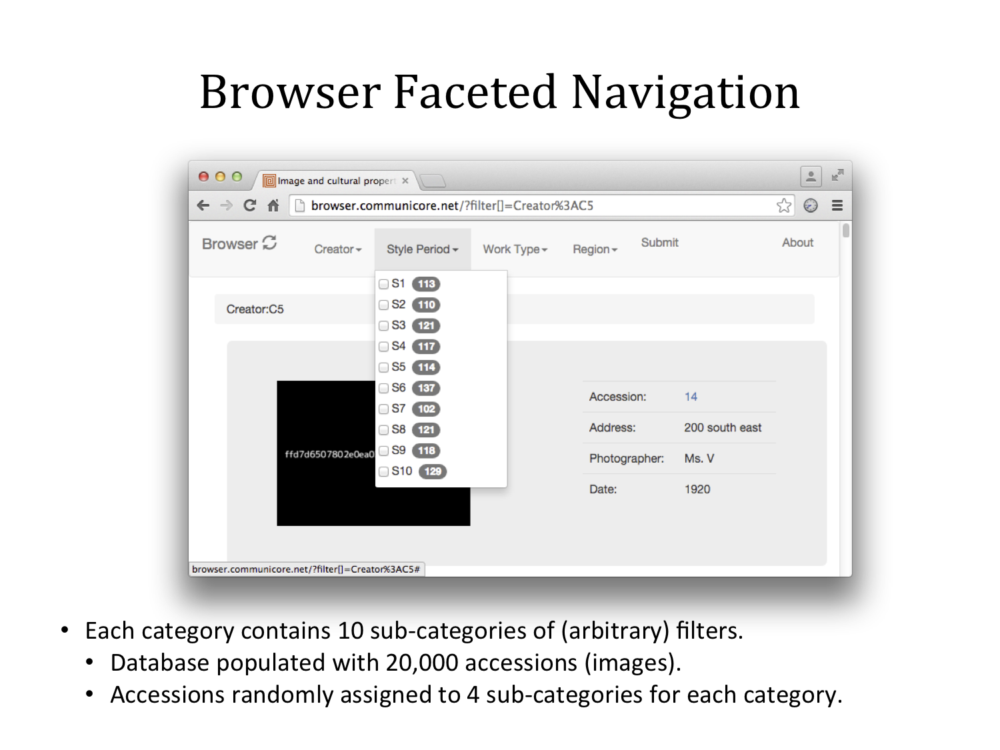
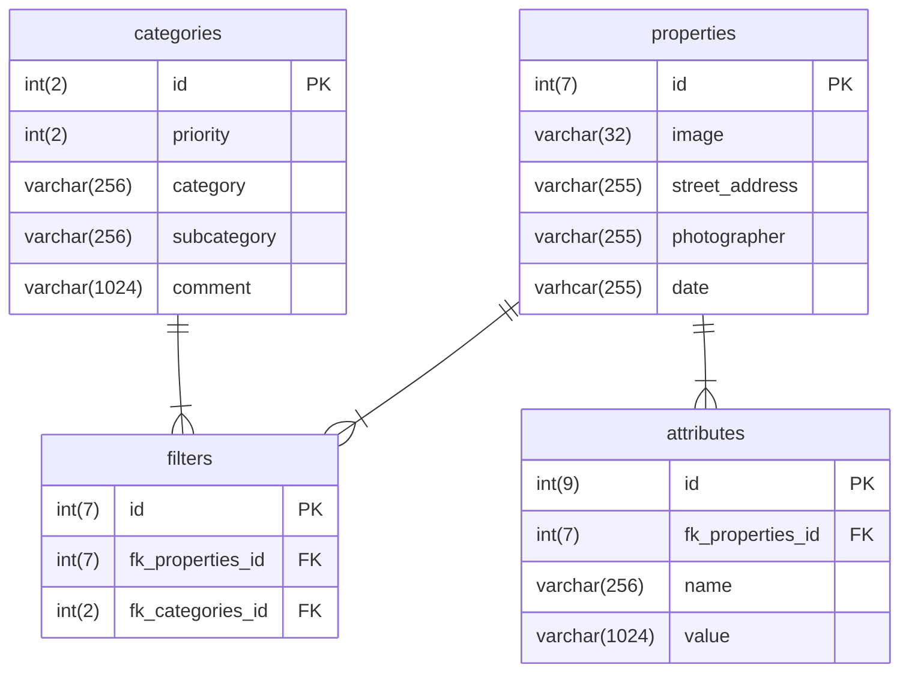

# Summary
Image and cultural properties browser

# Documentation 
[Lightning Talk](docs/browser-lightning-talk-20151118.pdf)

# Screenshot


# Schema

* `categories` table to help build navigation dropdown of categories and sub-categories
* `filters` table maps categories and sub-categories to each accession (image)
* `properties` table defines each of the 20,000 [randomly generated](tools/populate_database.php) accessions (images)
  * **Note:** `date` is not defined using the MySQL `date` type as the reference for this project contained arbitrary dates, e.g., "Temporal 1900-1909"
* `attributes` table stores additional, arbitrary metadata for each accession

# Setup
## MySQL
* View comments at bottom of: [Database.php](classes/Database.php)
* Modify `my.cnf` to enforce `sql_mode="STRICT_ALL_TABLES"` for primary/foriegn key InnoDB constraints.
* CREATE DATABASE
  * `browser`
* CREATE USER and GRANTS
  * `browser_www`
* CREATE TABLES
  * `categories`
  * `properties`
  * `filters`
  * `attributes`
* CREATE INDEX
  * `categories`
  * `filters`
  * `attributes`

### Populate database
* Copy [credentials.php-template](tools/credentials.php-template) to `credentials.php`
  * Configure values; database user must have a GRANT to perform INSERT.
* Run [populate_database.php](tools/populate_database.php)
  * e.g., `20000` accessions
  * Only run this script once. If you need to re-run then first drop the tables and recreate.
    * This is necessary as the script assumes a certain order/offset from the auto increment primary keys.

## Apache
Example is from Ubuntu `/etc/apache2/sites-enabled/` configuration files

### VHOST

#### Browser
* Per LightVC (https://github.com/awbush/lightvc) setup you must specify both the `DocumentRoot` and `Directory` as `webroot`
  * Do not specify these variables as the top-level directory, e.g., `/data/www/browser`
* Define `<MY FQDN>`
```
<VirtualHost *:80>

    ServerAdmin petersm3@onid.oregonstate.edu
    DocumentRoot /data/www/browser/webroot
    ServerName browser.<MY FQDN>

    ErrorLog ${APACHE_LOG_DIR}/error.log
    CustomLog ${APACHE_LOG_DIR}/access.log combined

<Directory /data/www/browser/webroot>
  AllowOverride All
  Require all granted
</Directory>
</VirtualHost>
```

#### CDN
* Simulated content delivery network (see Application documentation below)
* Define `<MY FQDN>`
```
<VirtualHost *:80>

    ServerAdmin webmaster@localhost
    DocumentRoot /data/www/cdn
    ServerName cdn.<MY FQDN>

    ErrorLog ${APACHE_LOG_DIR}/error.log
    CustomLog ${APACHE_LOG_DIR}/access.log combined

<Directory /data/www/cdn>
  AllowOverride All
  Require all granted
</Directory>
</VirtualHost>
```

## Application

### Content delivery network (CDN)
* Simulate CDN by deploying "Dynamic Dummy Image Generator" (http://dummyimage.com/) to VHOST.
  * The `index.php` is not required; `code.php` is required and referenced by `.htaccess`
  * GD required, e.g., on Ubuntu: `apt-get install php5-gd`
* Line 110 of code.php may need to have the explicit path to the font (on Ubuntu):
  * `$font = "/data/www/cdn/mplus-1c-medium.ttf";`

### Application configuration
* Copy [config.php-template](config/config.php-template) to `config.php`
  * Configure values
  * User should be `browser_www` with only a GRANT to SELECT.
  * `CDN_URL` is the VHOST defined for th content delivery network (above).
